## Design Walkthrough

Whenever I see an interesting new printer, or even a non-trivial mod, I don't want to just get access to the STLs or CAD...

I want to know what the designer was thinking, and why.  

I want to learn from them, to understand the design, as well as how it can be improved.

I want to avoid wasting time going down dead-ends trying to make it better, especially ones the designer has already gone down.

Dueling Zero will probably evolve faster with more eyes and more CAD designers taking a crack at it.  So to encourage action there, this section provides a walkthrough of the current status of the Dueling Zero design, covering all the key parts that are unique to it.  At the end are bonus pics from the early prototypes.

**The #1 thing about the design: it's all about being pragmatic**.

D0 is heavily optimized for using off-the-shelf parts from the stock V0 parts catalog, with off-the-shelf geometry... vs optimized for motion travel, or cost, or anything else.

Put another way, optimized for time-to-market.

**It’s not squeezing out every mm, and should have plenty of opportunities for travel optimization later.**

With that small caveat out of the way... I think there’s a lot of interesting stuff here!

More changes were needed than originally expected, and this section tries to summarize those changed or completely new parts.  Surprisingly, the toolheads and almost all Z parts are unmodified.

Highlights:

* No fundamentally new non-printed parts are needed.  You don’t need to cut any extrusions, and few holes needed to be drilled.
* The entire gantry floats within the frame.  After building, you can loosen 12 screws and then slide it up or down, to balance umbilical rubbing against Z travel.
* Correct, *there are no Z rails*.  This is not a CAD mistake.  I didn’t feel like buying any, and I didn’t know the optimal size anyway.  Printed sliders work fine as a replacement for rails, and you should expect more info about them soon.  If you want proper Z rails, no problem! They'll fit in place, just like on a regular T0.

### XY Motion

The soul of *this* new machine.  A two-headed beast.

The low-side (black, left-side) gantry went first, as I really wanted to improve the belt-mounting path on the carriage first, and *then* modify the resulting carriage design to support a higher set of belt mounts.

#### Low-side gantry

Take a look.  It's now underslung:

##### New Short X Carriage

The new X carriage is based on Double Dragon X carriage geometry, but modified to support both belts in one carriage.

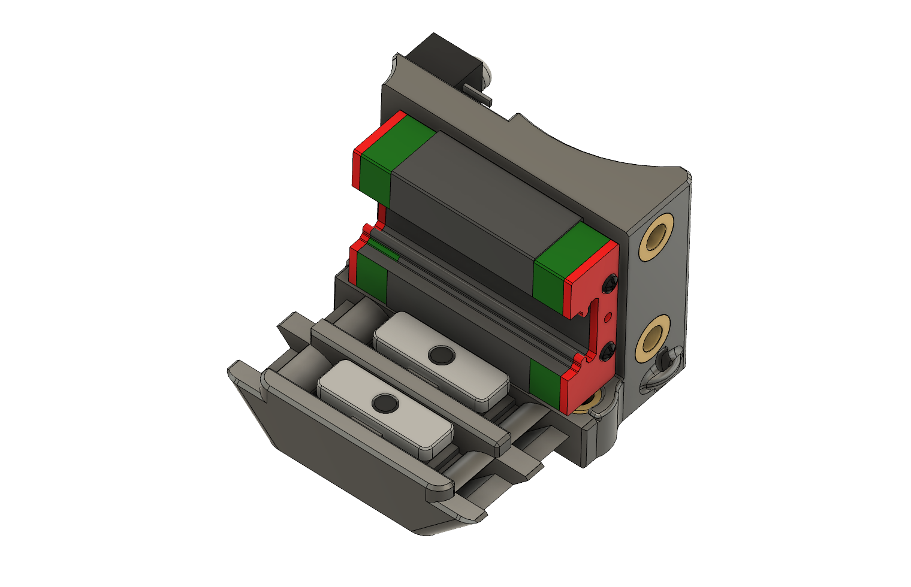

This new X carriage improves on the stock V0 carriage by enabling the belt loops to come back on the sides, providing grip for future re-belting, especially for printers where you can’t loosen the front idlers.

|  |  | 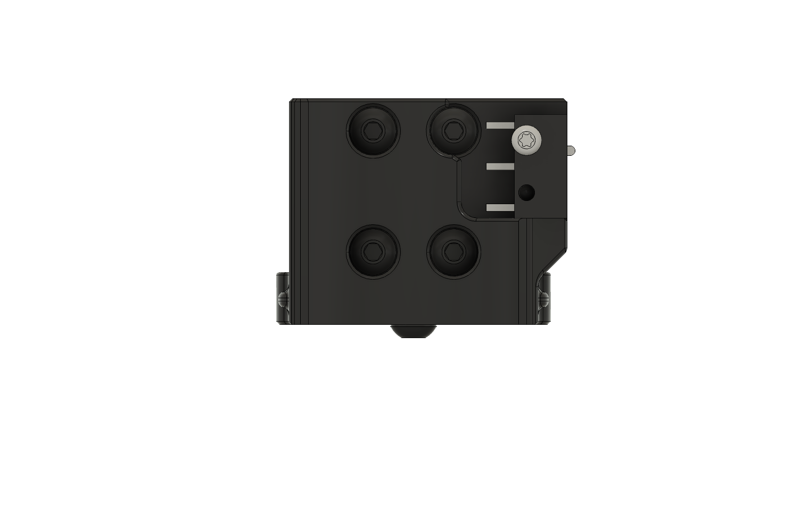 |  |
| - | - | - | - |

Highly recommended for your regular V0 or V0 mod!  Having to clip belts to length sucks.  No more, with this part.  You can see the belt path from the section view below.

Note also: this part is MGN9C-only.  MGN9C is a great mod to reduce the potential for "toolhead flop".  With the default low-preload MGN7 rails, especially when combined with a plastic carriage, there is a possibility of unwanted toolhead motion.  MGN9C adds a little weight and size, but you can trust the rigidity more.

##### Low-side XY Joints

These are a flipped-upside-down version of the original V0.1 XY joints:

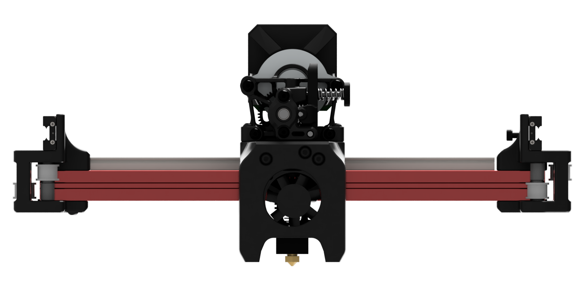

The flipped orientation enables both gantries to share the same pair of rails.  A few counterbores had to be reversed and height for extrusion mounting needed a lil' adjustment, but that was it.

| 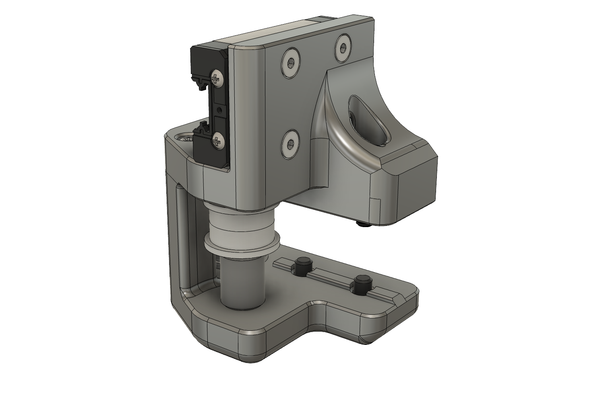 |  | 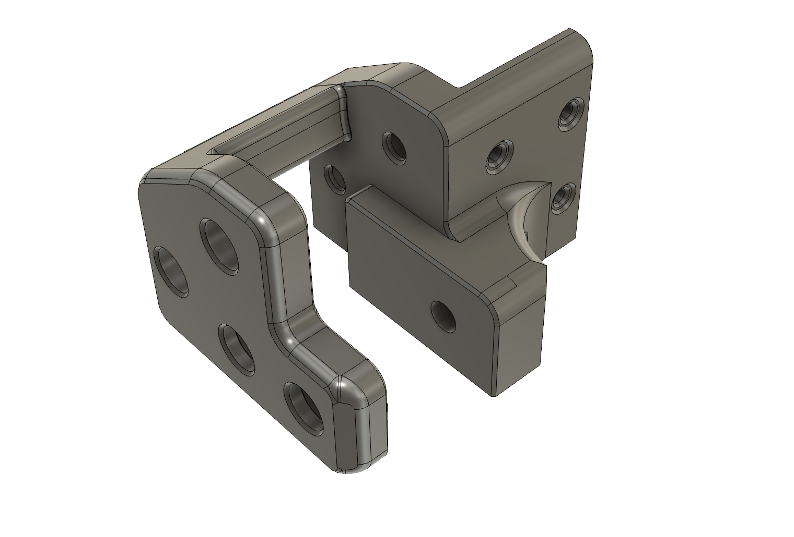 |
| - | - | - |

The endstop mounting on one side is simple and adjustable.  It's a hole for a screw to form a thread in the right spot.  The edge of a SHCS hits the plunger on a microswitch, directly.

#### High-side (high) gantry

This is the much more interesting half, with some new stuff:

The challenge here is that when you flip the belts to live above the carriages, the belts want to go through the extruder motor.  So you have to find a way to terminate the belt connections in a tight space, at a location that is away from the original crossbar, and hence, subject to large forces from the belt tension.

|  | 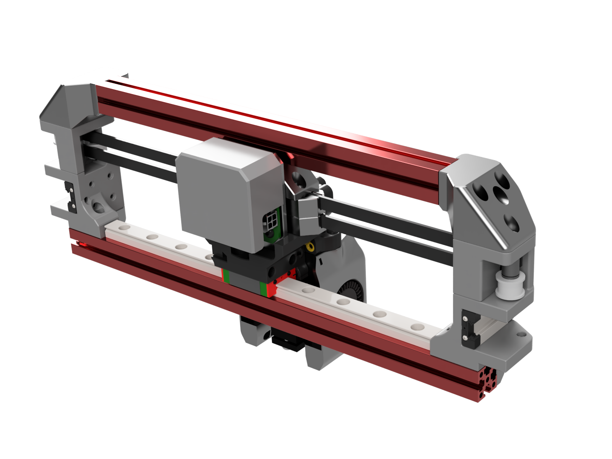 | 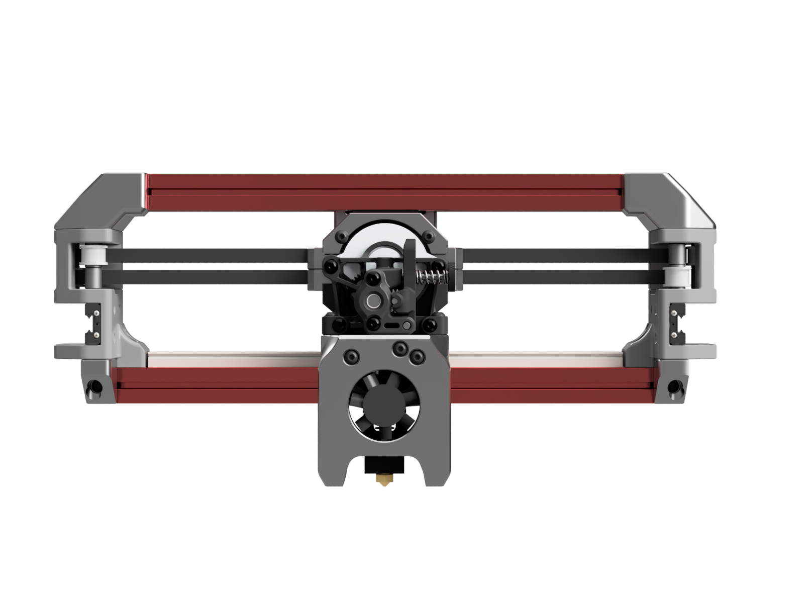 |
| - | - | - |

Reminds me a bit of the [Narushevich](https://www.airplane-pictures.net/manufacturer.php?p=1458)!

The toolhead looks like this, and has some real advantages.

| 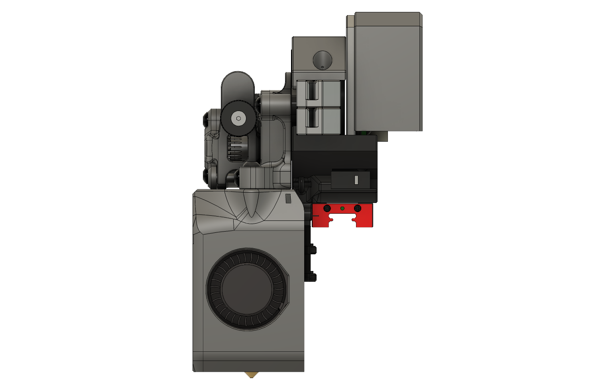 |  | 
| - | - | - |

For example:
* You can remove the Sherpa Mini extruder while leaving the toolhead board, carriage mount, and cowling in place.  Extruder maintenance is super-easy: remove two screws and one plug.
* The toolhead board mount is much more rigid, which should provide more faithful Input Shaper measurements for toolheads with integrated ADXLs (like Huvud 0.61, FLY-SHT42, or EBB42).
* The MiniAS supports a wide variety of hotends, and even multiple extruders.  It's a nice design.
* You can easily change out the entire X carriage assembly and retain the original tensioning setting.

However, the design is currently specific to the motor positioning of the MiniAS and the Sherpa Mini.  You can't currently use a MiniAB, as the holes there would be much lower, because the motor mounts lower.   

##### New Tall X Carriage

You've probably never seen a carriage mount quite like this. It’s a mod of the low-side X carriage, with provisions for belt attachments as well as a more rigid toolhead board mount.

|  | 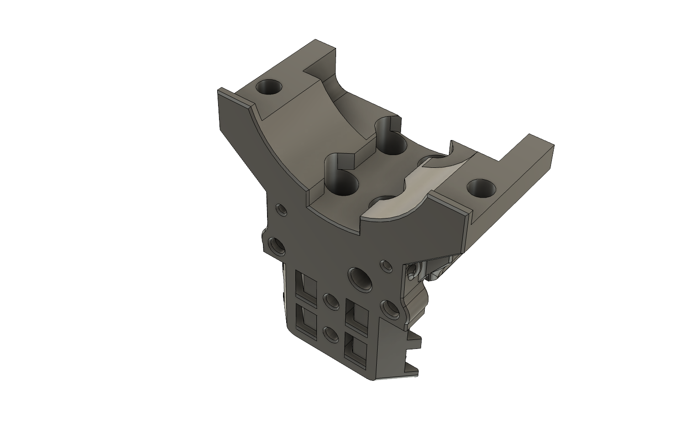 |  |
| - | - | - |

The lower belt attachments remain, so that you can use the same part on the low side too, with the benefit of the more rigid toolhead board mount.  This isn't shown in the renders yet, but it's not too hard to imagine.

##### Belt Grabs

The geometry of the belt attachments comes from F-Zero and Tri-Zero, which use toolless belt grabs for their Z axes.  

This geometry works great here too, and it makes the entire toolhead easy to remove and then add back.  That’s important for a designer expecting to make many X carriage tweaks, for example, to add wire management, but probably not a big benfits for most builders.  

##### Toolhead Board Mount

The toolhead mount is sized for a NEMA17-hole-pattern-compatible square toolhead board.

For now, this part assumes board-specific spacers to work with multiple board-spacer heights, but it could (and probably should) be an integrated part in the future with board-height-specific variants.

##### Y Toolhead Strut

This part strengthens and locks in all the belt grabs, but also provides a surface to rigidly mount the toolhead plate on top.

The whole X assembly here is so much more rigid than in Double Dragon, where the entire toolhead board and shroud is dangling and can flex behind the extruder stepper.

##### Y Gantry Strut

Why?  Without this, the belt tensioning forces bend the upper XY joints inwards, which would surely cause belt damage over time.  Resist the forces!

Going with a strut was the fastest design solution here.  I don't particularly like it.  It gets in the way of tightening things.

In a future design, a symmetric gantry with changed motor and cowling mounts might remove the need for this part entirely.  

##### High-side XY joints

These ended up as a 4-part stack.  The geometry complexity enables support-free printability.

It's not the most elegant, but it works.  And it's rigid enough to transfer belt tensioning forces to the strut.

| 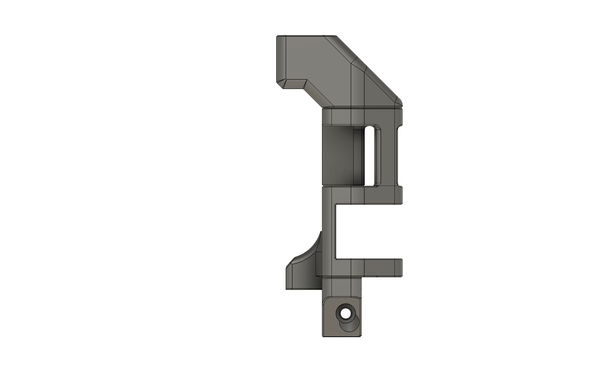 | 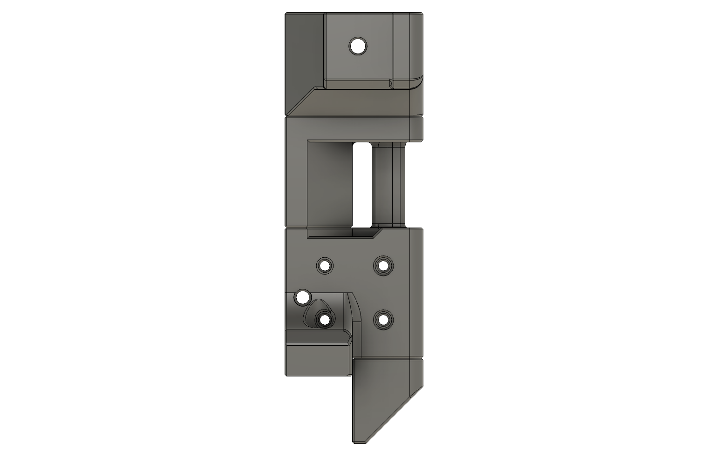 |  |
| - | - | - |

#### X Endstops

The new height of the gantry crossbar relative to the AB blocks meant that the endstop had to move.  Here, it’s a minimal, adjustable, and symmetric design.

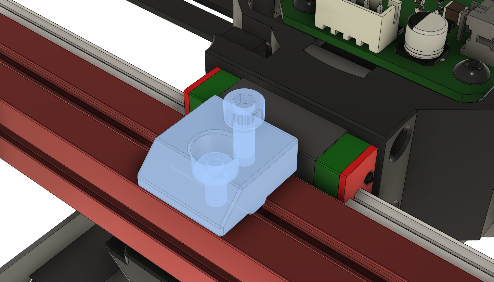

A similar matching part holds the microswitch to the gantry crossbar.  

NOTE: on D0 these are X endstops.  On a V0 or similar, these would be Y endstops.  It's all twisted!

#### Modified BoxZero AB blocks

To get closer to full X motion, BoxZero idlers needed a mod to provide more clearance for a "toolhead backpack" - the area behind the motor where a toolhead board can go.  Normally such a cutout wouldn’t be needed, but the changed height of the fixed gantry-frame crossbar causes the toolhead-board backpack to get in the way.

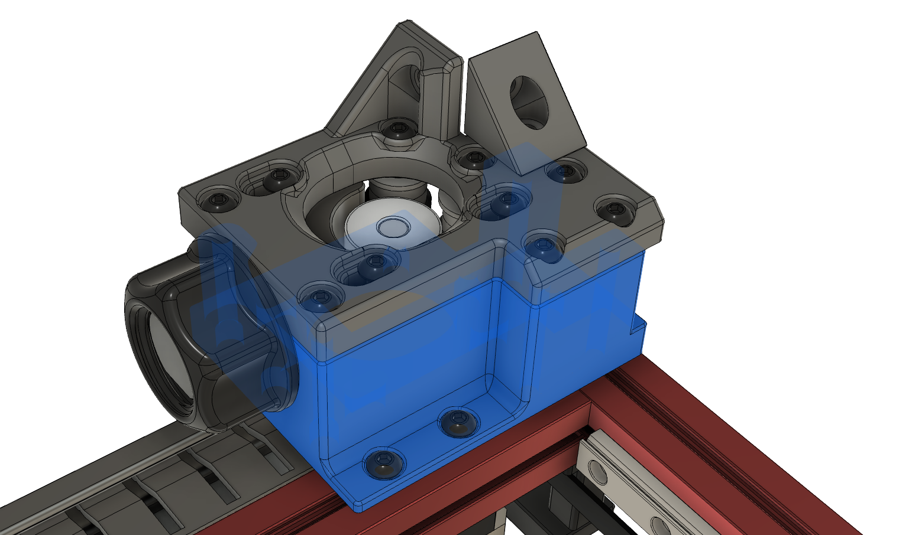

This notched version is only needed on the high-side gantry, so if converting from a regular B0, you can reuse the AB blocks.

#### BoxZero-derived idlers

These parts are no strictly needed, and in fact, originally the gantry used stock B0 idlers, but they provide visual symmetry with the AB blocks (I know, I know...).

These use the usual V0 9mm drive spacers.

#### Toolhead Umbilical Receiver

Derived, in principle, from the F0 umbilical, but without a cover.  Fits a cable gland and routes wires to the nearby cable channels.

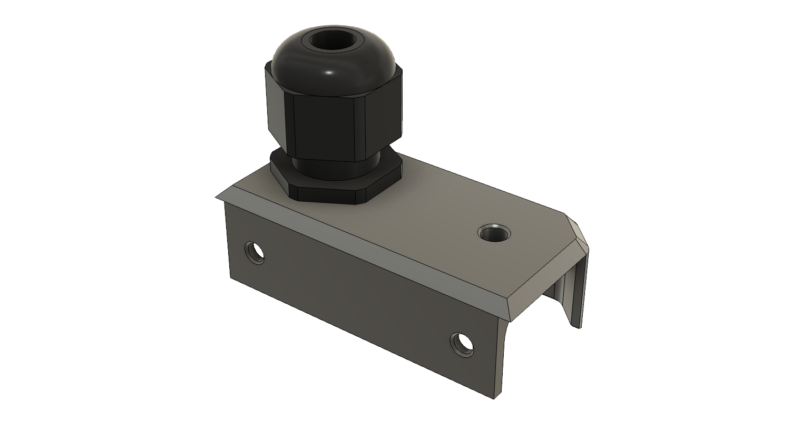

A potential improvement here: to add push-fit connections on top and bottom, to enable low-friction rotation of the reverse bowden tube, as well as enable variable-length reverse bowden tubes to the filament feed.

### Prototypes

If you have V0 AB blocks lying around, you can even make a test gantry like this:

|  | 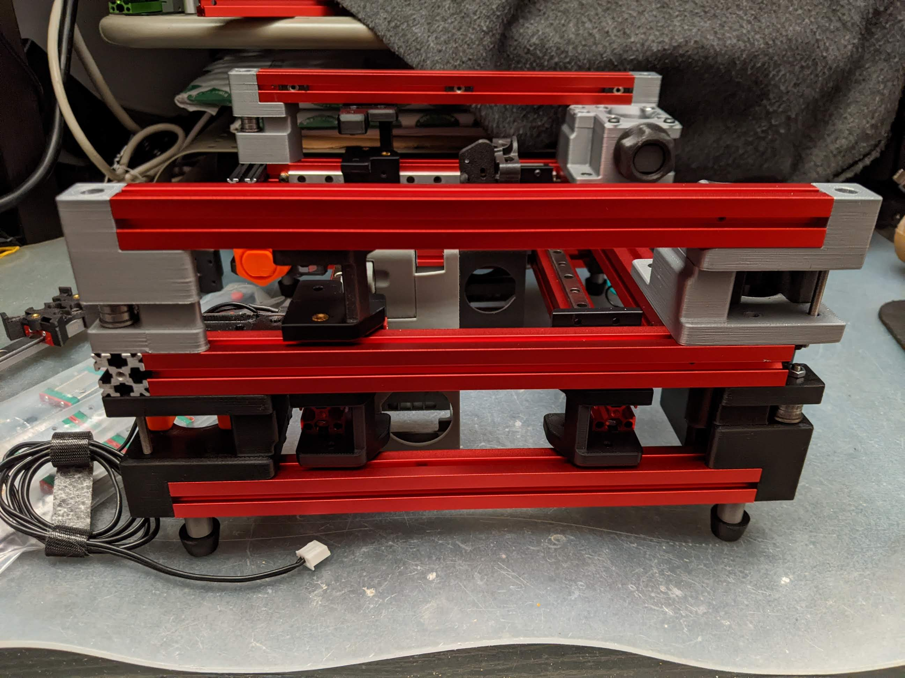 |
| - | - |

This was the first test gantry to prove out the concept.  BoxZero AB blocks are a much better fit, though, as they enable you to build the gantry separately, then drop it into the frame from the top.  

The second test gantry moved to BoxZero-derived ABs, with additional width and length, and lived for a bit in a "stubby Z" test config.  This one had a unpowered Z travel of 10mm (!), but helped iterate on gantry and bed parts.  In particular, the test gantry made clear that achieving a target X motion of 170mm would require adding width.

|  |  |  |
| - | - | - |

The third and final gantry is 30mm wider, using 15mm corner cubes between 300mm horizontal extrusions and the frame.  Once belted up, this gantry supported validation of the collision avoidance code.  Let’s just say the toolheads have butted heads once or twice!
