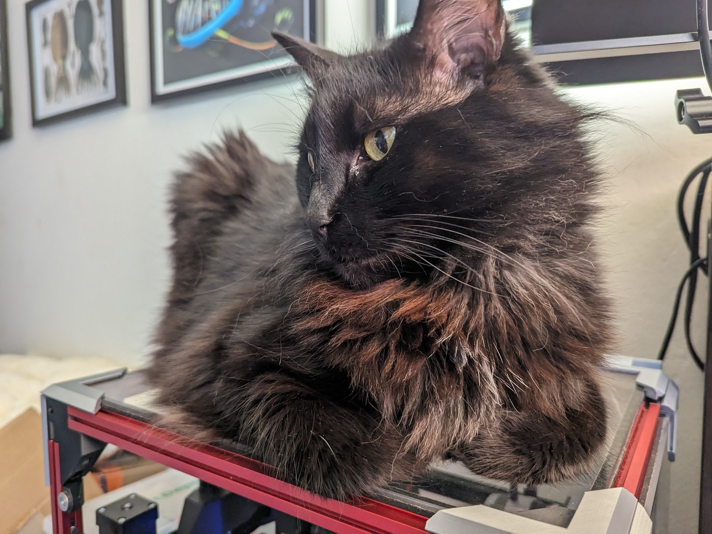
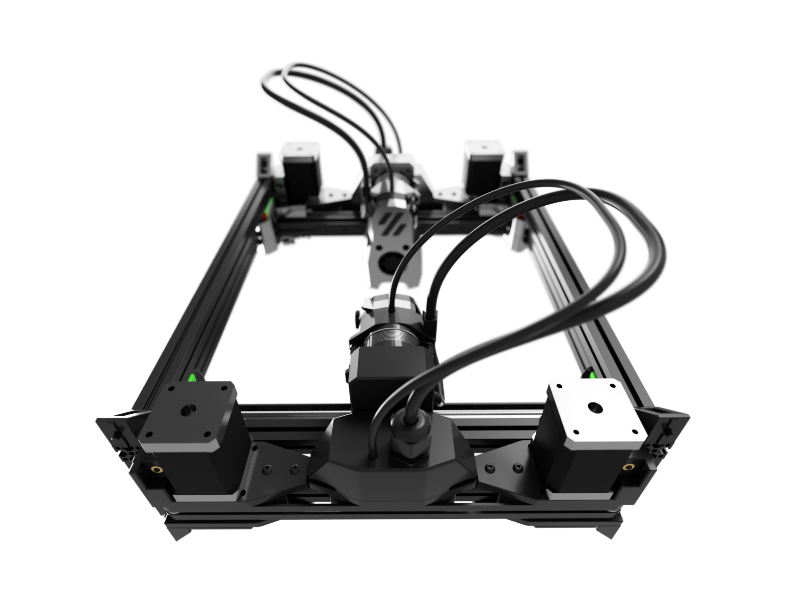
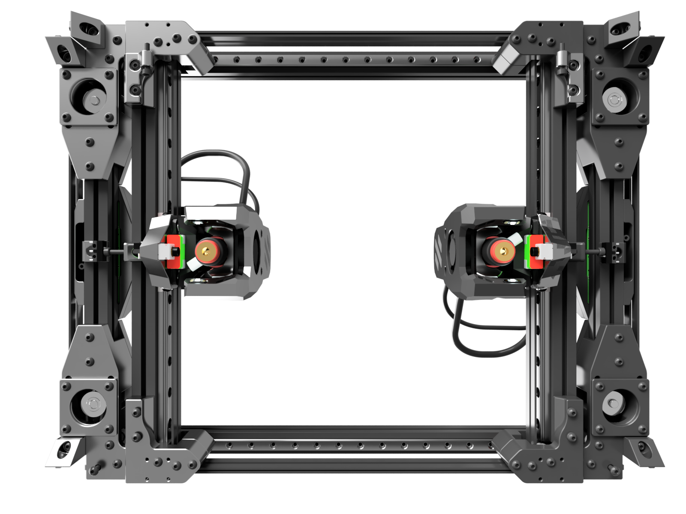
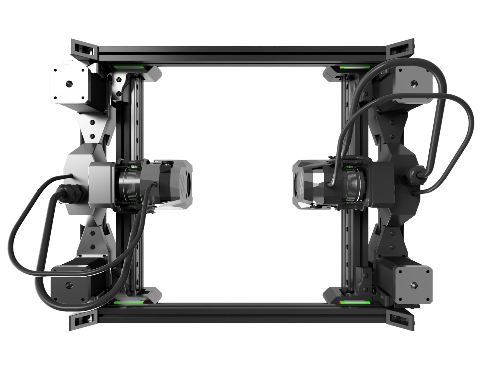
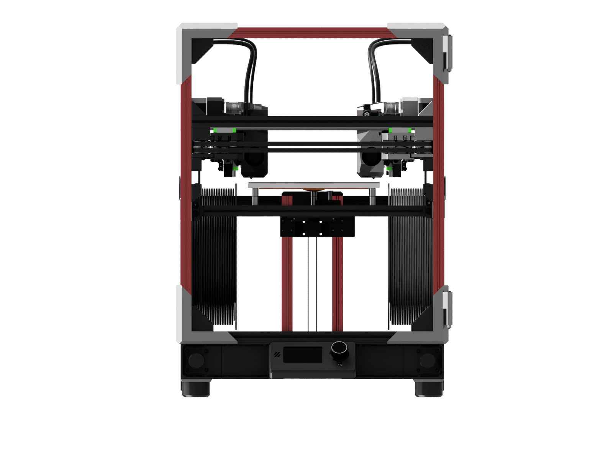
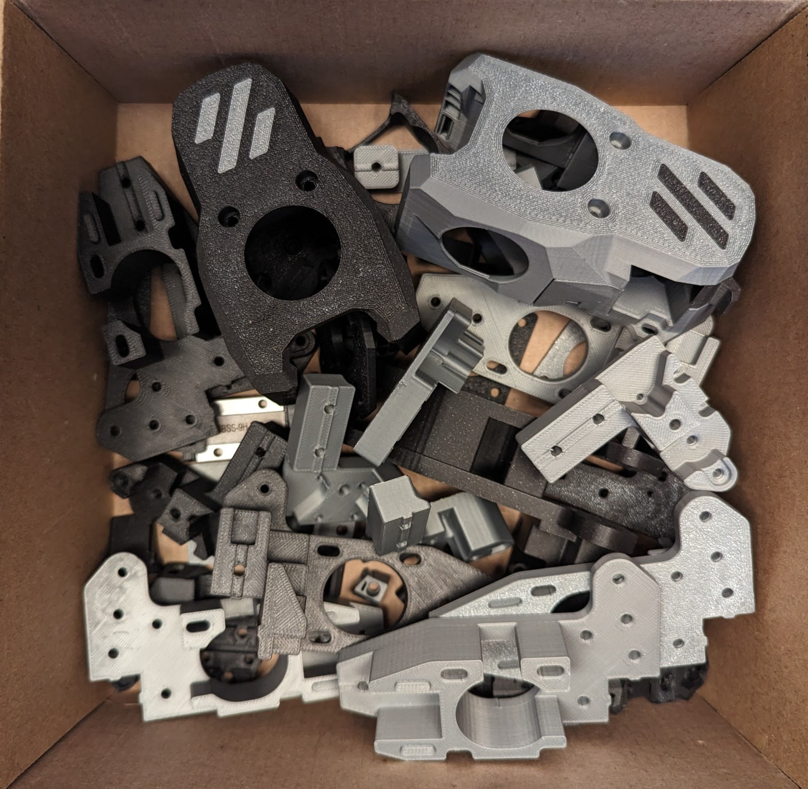
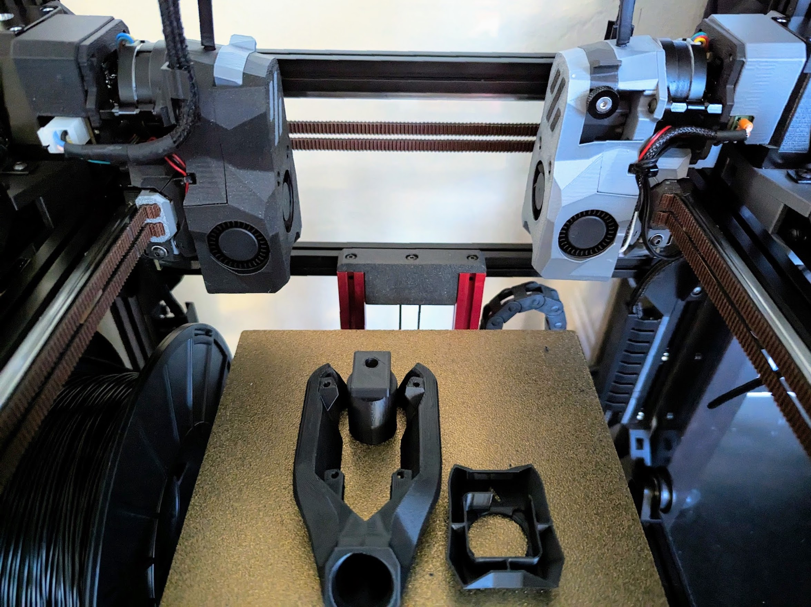
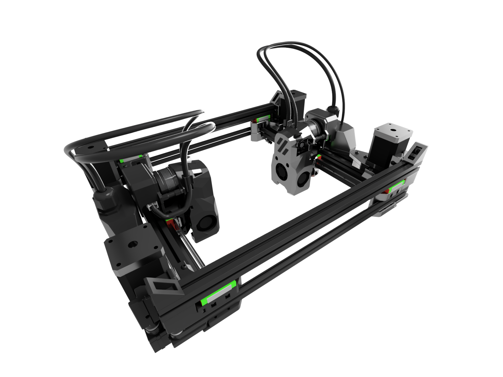

## Dueling Zero - a Dual Gantry V0 mod

**Two extruders.  No compromises.**

Enable dual-color, dual-material, and dual-part printing... with the same speed and quality as single-extruder printing.

Mod a [Voron Zero](https://vorondesign.com/voron0.2) or build one fresh!

**D0** is the only open-source, fully-documented, reproducible-by-anyone Dual Gantry printer out there.

|  |  | 
| - | - | - |

Curious?  Watch it print below!

# [> > > Watch Video from first prints](https://youtu.be/2YI3_g30EwA)

(original v1 gantry shown)

## Release History

**2023-09-16 v3 Gantry release and updates**

This release moves to a completely-new, symmetric, nested belt path:

|  |  |  |
| - | - | - |

This new [Pandora's Box](https://github.com/MasturMynd/Pandoras_Box/tree/main)-derived gantry design, created in close collaboration with `Desune` on Discord, has far fewer unique parts (for better portability to other sizes) and adds travel.

|  |  |  |
| - | - | - |

Here's the side-by-side comparison from above, with v1 on left, and new v3 on right:

|  |  |
| - | - |

Or, in reality:

|  |  |
| - | - |

The printer looks a little different now, with internal spool holders!

|  |  |  |
| - | - | - |

In short - **this is a big update**.  *This is what D0 should have always been.*

Sometimes it's only through iteration and collaboration that you get to what feels right.  **The v3 gantry feels right**.  

No weird strut, no flipped motors, smaller, more maintainable... all-around, better.

The gantry improvements are summarized below:

Other major improvements to call out:

* **Boop support by default**: for perfect first layers every time, nozzle probing with [Boop](https://github.com/PrintersForAnts/Boop) is now the default.  There are no magnets to get loose in a heated chamber and no probe motions to configure anymore.
* **Voron 0.2-compatible toolheads now fit**, including the Voron Mini Stealthburner toolhead, shown in these renders.
* **Gantry board support** for the [GBB15 gantry board](https://github.com/skuep/GBB15) - enables super-clean, easy wiring with magnetic-attach covers
* **Dual internal spool holders** added

For previous updates, see the [Updates](updates.md) page.

## Table of Contents

There's a ton of detailed content in this repo, beyond this README.

- #### [Overview](#overview): Why Dual Gantry?
- #### [Updates](#updates): Major Release Updates
- #### [Software](SOFTWARE.md): Two toolheads in one workspace, explained
- #### [Parts](PARTS.md): Parts list to build your own
- #### [Instructions](INSTRUCTIONS.md): Instructions to print, assemble, and configure
- #### [FAQ](FAQ.md): Common questions, answered
- #### [Archived v1](Archived-v1/REAMDE-v1.md): Prior design

## Sample Builds

### Zruncho's Red/Black Build

Originally [V0.562](https://www.reddit.com/r/voroncorexy/comments/odfid1/voron_00_serial_request_zruncho1790/), then the first Dueling Zero, and now with the v3 gantry:

|  |  |  |
| - | - | - |

Highlights of this particular build:
* XY Motion and Toolhead
  * [Boop beta-4](https://github.com/PrintersForAnts/Boop/tree/main/beta_4)-based carriages with nozzle bed probing, plus rear threads for toolhead boards
  * [MiniSB](https://github.com/VoronDesign/Voron-0/tree/Voron0.2r1/STLs/Toolheads/Mini_Stealthburner) toolheads with [Revo Voron](https://e3d-online.com/products/revo-voron) hotends - V0.2r1 version
* Frame and Z Motion
  * Rail-less Z motion (!) using printed Tri-Zero MGN7-compatible sliders
  * [Tri-Zero](https://github.com/zruncho3d/tri-zero) triple-belted Z with tool-less belt attachments
  * LDO Red 1515 V0 frame kit + MakerBeamXL 1515 pieces cut to size
  * AC 180x180 [Prusa Mini size plate bed](https://www.aliexpress.com/item/3256803530287164.html) with textured and smooth PEI sheets
* Electronics
  * 2x [GBB15](https://github.com/skuep/GBB15) gantry boards
  * 2x EBB42 toolhead boards
  * BTT U2C USB CAN board
  * LRS-150-24 Power Supply
  * Raspberry Pi 3B
  * SKR Pico controller boards for Z motion
  * Mini 12864 display with [Klipper adapter](https://www.aliexpress.com/item/3256802553287831.html)
  * 2x Fysetc PIS USB ADXL boards mounted to x carriages
* Other
  * Panels: [ZeroPanels v3](https://github.com/zruncho3d/ZeroPanels) with optional midclips and rear-hinged top panel
  * Travel: 166mm x 180mm in XY, ~130mm in Z (not optimized!)
  * Filament: mix of KVP ABS flavors: Metallic Silver, Black, and Stellar Black.
  * [PrinterExperiments](https://github.com/zruncho3d/printer-experiments) code for easy Z nozzle alignment with a single command

### Desune's Silver Build

TBA

## Overview

### What’s a Dual Gantry printer?

**Dual Gantry** is a rare 3D printer type with two toolheads moved by **two** *completely independent* XY motion systems:

 

Yes, you’re seeing double, with black and silver toolheads in a dual-CoreXY motion configuration.

### Why a Dual Gantry printer?

In general, a second hotend adds enormous flexibility - to support two colors, two materials (typically support + main), and two nozzle sizes, in one print, with no color-bleed issues, cross-contamination, or wasteful purging.  Sounds good, right!

Well, that second hotend, if mounted on a single toolhead, can get in the way of print quality, as it drools filament when not in use - and the toolhead is now custom. :frowning:

So along comes IDEX, short for Independent Dual Extrusion, which adds a second, independent toolhead on a shared axis (typically the X axis).  Sounds better, right?

No drool, plus something cooler: one printer can now print two identical parts simultaneously, in mirror or duplicate modes. :muscle:  (note: in theory; depends on firmware support)

Open-source IDEX designs include [Voron](https://vorondesign.com/)-derived ones, like [Zruncho](https://github.com/zruncho3d)’s [Double Dragon](https://github.com/zruncho3d/double-dragon), [Eddietheengineer](https://www.youtube.com/eddietheengineer)'s [Tridex](https://github.com/FrankenVoron/Tridex/), and [Ankurv](https://github.com/ankurv2k6)’s [IDEX Switchwire](https://github.com/ankurv2k6/voron_idex_switchwire).  There's also the [Muldex](https://github.com/3dprintingworld/MULDEX), and there's no shortage of commercial examples, too: [Sovol SV04](https://sovol3d.com/products/sv04), [FlashForge Creator Pro](https://www.flashforge.com/product-detail/flashforge-creator-pro-2-3d-printer), [BCN Sigma](https://www.bcn3d.com/bcn3d-sigma-d25/), [Jadelabo J1](https://www.jadelabo.com/), and many more.

But that second toolhead comes at a cost: moving mass, which has effects on print speed (max accel) and quality (typically, ringing artifacts).  :neutral_face:

> Simplify, then add lightness - [famous quote from Colin Chapman at Lotus](http://www.lotuscars.com.tr/about-us/lotus-philosophy/index-31332.html#:~:text=At%20the%20root%20of%20our,was%20another%20of%20Chapman's%20premises.)

Whether building a fast race car or a fast printer, physics can't be ignored.  

You can mitigate the moving mass somewhat, by using a lighter toolhead, typically with a remote Bowden extruder, but Bowden extruders introduce their own tuning challenges.

**With Dual Gantry, you get a no-mass-added gantry for the common case of single-extruder prints.**  Unlike an IDEX, here, each toolhead is *truly independent* and can move in X *and* Y on its own - [potentially to print two completely different objects at once!](https://forum.duet3d.com/topic/27895/beta-testers-for-multiple-motion-system-support)

There’s no hit to max acceleration or potential for ringing caused by dragging around a heavy second toolhead on a longer rail all the time.

Sure, you can't print more than two colors, like a multi-material unit or toolchanger can, but everything in engineering is tradeoffs.  [As Nero says](https://youtube.com/clip/UgkxAxd22dVnUN7P749WHRpp-yFLg3WqvwTv):

> Multimaterial... sucks.  OK?  There’s no way to do it right.  So either you spend money, time, or waste.  No matter what you do, you're gonna be dealing with that.

Dual Gantry is in an interesting point in a larger space.  **Medium money, medium time, minimal waste**.  It fits within a broader space of 3D printer types that support multiple-extrusion, where the number of toolheads, hotends, and extruders varies:

Take a look here, or at [this other helpful categorization](https://gist.github.com/kmcallister/6636d88802ba00432c65d14e9431c0e6).  This diagram is not comprehensive, but gives a sense for the depth of the design space, and especially, the rarity of everything not on the far left side (typical single-extruder printer).  For some interesting points in the design space, there's only one commercial example!  

(Please file an issue on GitHub if you know of any significant omissions.)

### What’s the catch?

If it sounds too good to be true... it probably is.  :shrug:

You don't have to design it (anymore), but you still need to build it, which is roughly twice the work of a typical printer.  Plus, compared to a typical single-extrusion, single-toolhead 3D printer, there are added cost, complexity, and alignment challenges.

**The main reason you probably have never seen a Dual Gantry 3D printer: firmware support.**

Support for two gantries with one control board is a good start:
* RepRapFirmware: supports two active gantries, out-of-the-box.
* Klipper: thanks to a collaboration with [tircown](https://github.com/tircown), there's a PR available now.
* Marlin: no.

To get full motion out of a shared-workspace printer, however, you really want active collision detection and avoidance.  

See the [Software](SOFTWARE.md) section for a full explanation, with diagrams, pics, and explanations, as well as code that implements collision detection and avoidance.

### How does this mod work?

Start with a Pandora's Box gantry.  Turn it 90 degrees.  Modify it to add extra bearing stacks and combine idlers with AB blocks.  Duplicate it about the center.

Then when mounting, flip it upside-down.  

Add off-the-shelf Boop and v0.2-compatible toolheads.

That’s the core idea.

In practice, though, there are quite a few additional bits to design to make it work.  And like with any V0 mod, the devil is in the packaging details: *every mm matters*.

For the rest of the printer, D0 heavily leverages off-the-shelf parts from these repos:
* [BoxZero](https://github.com/zruncho3d/BoxZero) ditches the V0 tophat
* [TriZero](https://github.com/zruncho3d/tri-zero) adds automatic bed leveling and enables XY scalability
* [ZeroPanels](https://github.com/zruncho3d/ZeroPanels) add snap-in panels
* [Boop](https://github.com/PrintersForAnts/Boop) adds highly accurate nozzle probing
* [Voron V0.2](https://vorondesign.com/voron0.2) provides a good toolhead default

If you're not familiar with these mods, here's a pic, showing a Plus50-size Tri-Zero + BoxZero printer (170x170 bed motion), next to a V0-size (120x120 bed motion) Tri-Zero + BoxZero.  Both have ZeroPanels.

### Learn more!

If you've read this far, great, but there's more good stuff.

There's lots more info beyond this README file, in the repo, split into multiple pages.  And the [V1 Archives](Archived_v1/) section provides a view into the original design that you might find interesting.

Take a look around, or up at the Table of Contents above.

## Links

### Dual Gantry

They do exist.  Others have built printers or similar CNC devices with at least two gantries operating in a single shared workspace:

* [Essentium HSE 280i](https://www.essentium.com/3d-printers/high-speed-extrusion-280/): large, high-dollar, linear-servo printer with two gantries
* [Cronus](https://www.youtube.com/watch?v=TkEOMQ6rQ6s): a 5-head, single-workspace 3d printer
* [Dual Gantry CNC Machining Centers](https://www.cronsrud.com/cro-dual-gantry.html): a related CNC
* [Earlier motion platform example](https://www.youtube.com/watch?v=S_7VCEe3hOk): dates to 2012!

There are also a bunch of posts online with people conceptualizing the concept, dating back years.  The benefits/drawbacks are relatively straightforward to understand, though not widely known.  For a few builds, there are mentions online, but no reference to a video of the machine printing, or a link to learn more.

* 2018-06-04 [Duet Forum post by 3D_low](https://forum.duet3d.com/topic/5561/did-anyone-make-a-idex-with-dual-x-gantry-bar): "Did anyone pull that off yet? i havent found one on the net."
* 2018-11-21 [Duet Forum post by Haggan90](https://forum.duet3d.com/topic/7796/haq-xy/122): HaqXY is a dual Hybrid-CoreXY
* 2021-03-01 [r/3Dprinting post by u/m47812](https://www.reddit.com/r/3Dprinting/comments/lv8ksv/developed_a_new_kind_of_dual_extruder_system_on/): "CODEX" project.  Video shows a fairly far-along dual-gantry; describes collaborative mode too.  Abandoned as of 2023 in favor of a toolchanger.
* 2021-05-01 [r/Reprap post by u/lowfat](https://www.reddit.com/r/Reprap/comments/n2tkvb/corexy_with_dual_fully_independent_gantries/): postulates DG, but abandoned in favor of a toolchanger
* 2021-07-21 [Duet Forum post by breed](https://forum.duet3d.com/topic/24258/independant-dual-gantry-corexy/10?_=1657058082320): "Independent Dual Gantry CoreXY"
* 2021-09-17 [Duet Forum post by oliof](https://forum.duet3d.com/topic/25158/core-xy-idex-with-two-gantries/15): "Core XY - Idex with two gantries", has a nice diagram
* 2022-01-27 [Klipper Discourse post](https://klipper.discourse.group/t/dual-gantry-printer-with-single-mcu-btt-gtr-btt-m5/1900): Dual gantry printer with single MCU
* 2022-03-25 [Duet Forum post by dc42](https://forum.duet3d.com/topic/27895/beta-testers-for-multiple-motion-system-support/41): Beta testers for multiple motion system support: simultaneous multi-printing for RRF v3.5.  Note two pictures, for motion designs from breed and slaughter2k
* 2022-06-23 [Duet Forum post by zruncho](https://forum.duet3d.com/topic/29023/independent-dual-gantry-any-examples-out-there/10): is anything out there?

Please raise an issue for this repo to update the list of links if you come across one!  There’s no pretense of true originality here.

### Related

* [Bill Deckingham’s beast](https://www.youtube.com/watch?t=488&v=O_whcaAJpfs&feature=youtu.be): a CoreXYUVAB system, with extra axes for a very different reason.  Maybe some software lessons or relevant RRF config here?
* [Hashprinter](https://forum.duet3d.com/topic/24287/hash-printer-with-super-simple-gantry/2): super simple gantry
* TAMV = Tool Alignment with Machine Vision: a way to automate XY calibration
  * [Jubilee Toolchanger page](https://jubilee3d.com/index.php?title=TAMV)
  * [HaythamB fork](https://github.com/HaythamB/TAMV)
  * [TAMV on Klipper](https://github.com/TypQxQ/TAMV)
* [Klipper PR by Tircown that adds duplication and mirror modes](https://github.com/Klipper3d/klipper/pull/4464)
* [PitStop3](https://mihaidesigns.com/pages/pitstop-3-multi-material-3d-printer): hotend-swapping multi-material printer
* [Swapper3D](https://www.kickstarter.com/projects/bigbrain3d/swapper3d): nozzle-swapping multi-material printer
* [Enraged Rabbit Project](https://github.com/EtteGit/EnragedRabbitProject): add multimaterial capability
* [3D Chamaleon](https://www.3dchameleon.com/): automatic color changer

## Credits

* **Desune**: designed Dueling Boops (the honorary v2 gantry) and co-designed the v3 gantry w/Zruncho.
* **MasturMynd**: designed Pandora, which made this possible.
* **Tircown**: made a single-Klipper-instance version possible, with his code and live debugging
* **Clee**: saved the project with some hardcore hardware rescue with the STM GB01 chips
* **ToxGunn**: diagnosed a stepper overcurrent issue and saved me more plastic and motors
* **Reviewers (for v1): Red5, _xbst, where’sthelambSAUCE, BeastBc**: thanks for providing feedback that helped make this clear and concise.
* **Clee, Red5, Kyrios, Leopard, EddieTheEngineer, and others**: initial conversations proved motivating - that this wasn’t completely insane.  Thanks!
* **Nemgrea**: none of this would have happened without a solid base.

## Support

The best place to ask questions and see the latest is on the DoomCube Discord, where many Printers For Ants builders hang out.  Go to the `#dueling-zero-dev` thread in the #tri-zero channel.  Put your build log in the `#build_logs` showcase forum there too!

