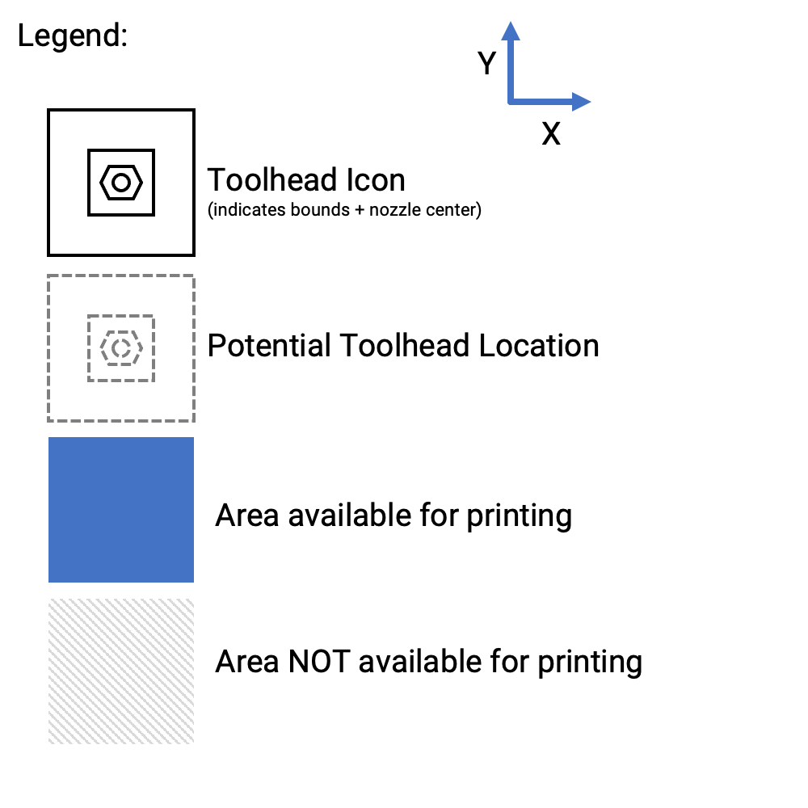
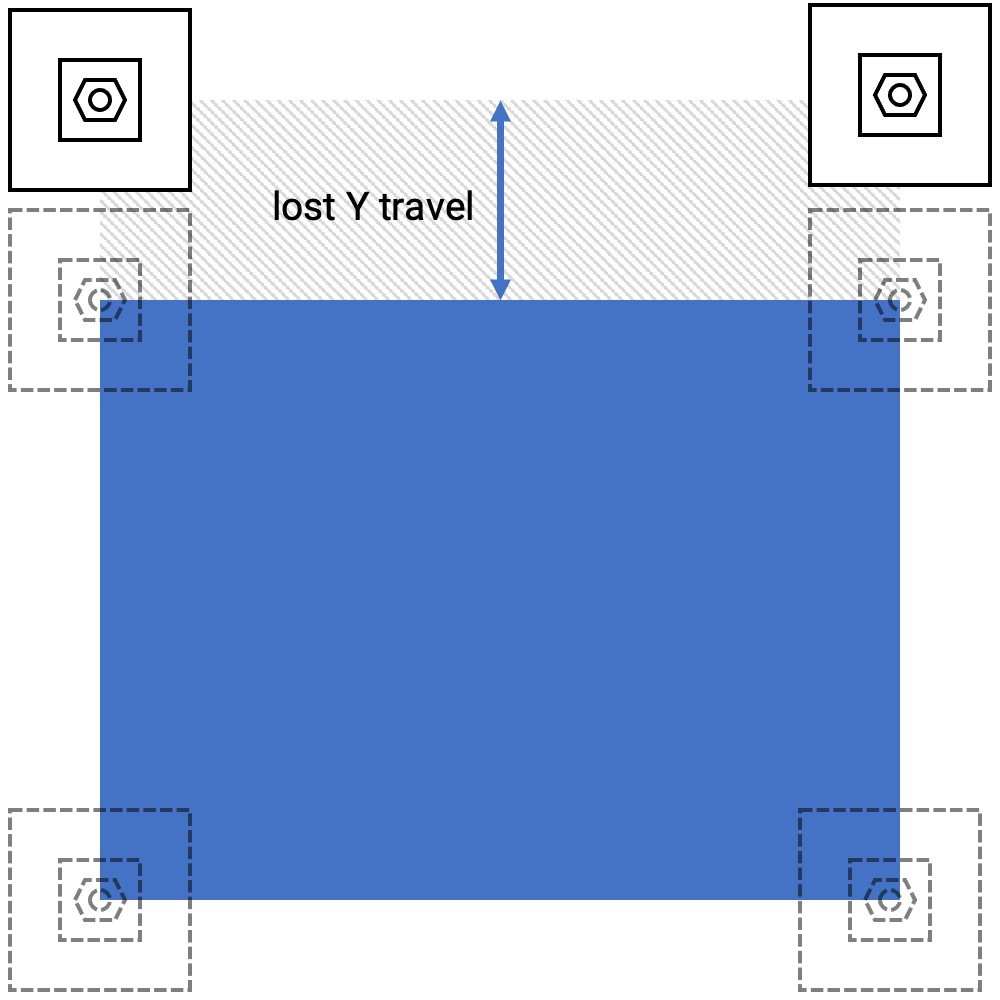
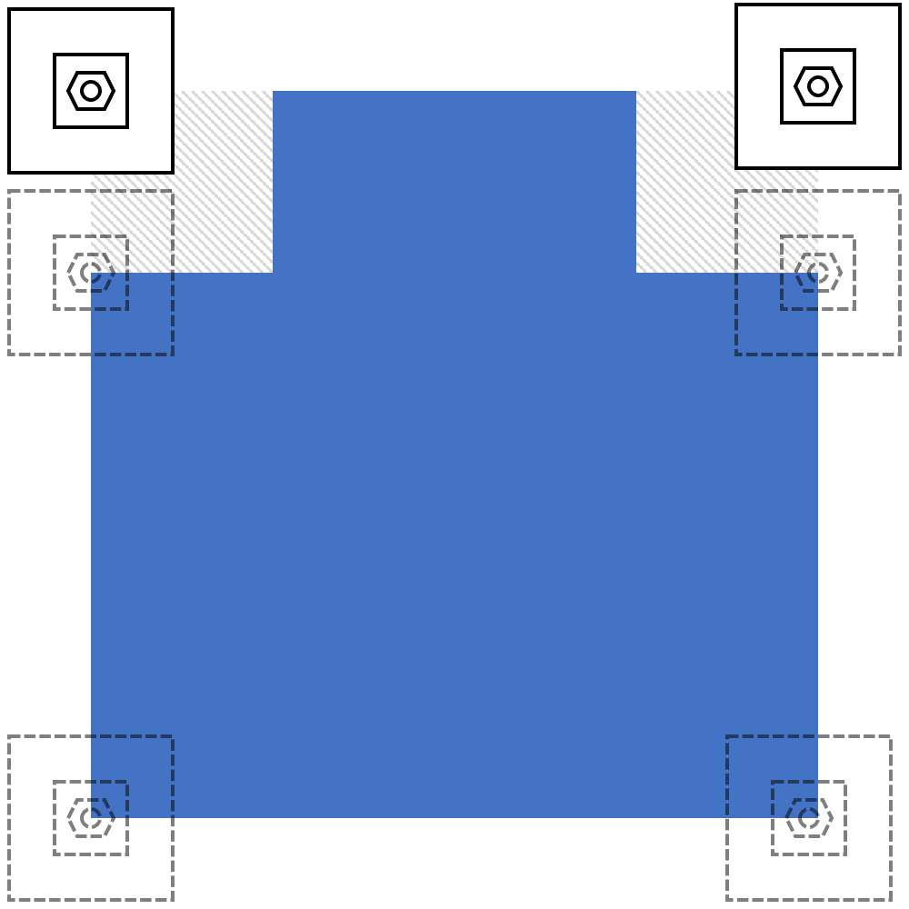
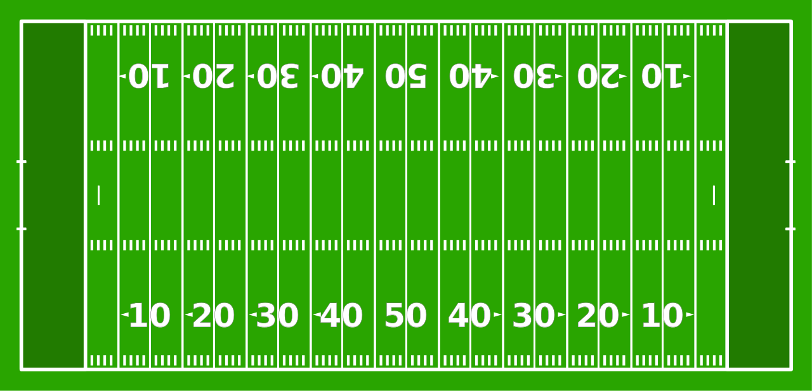
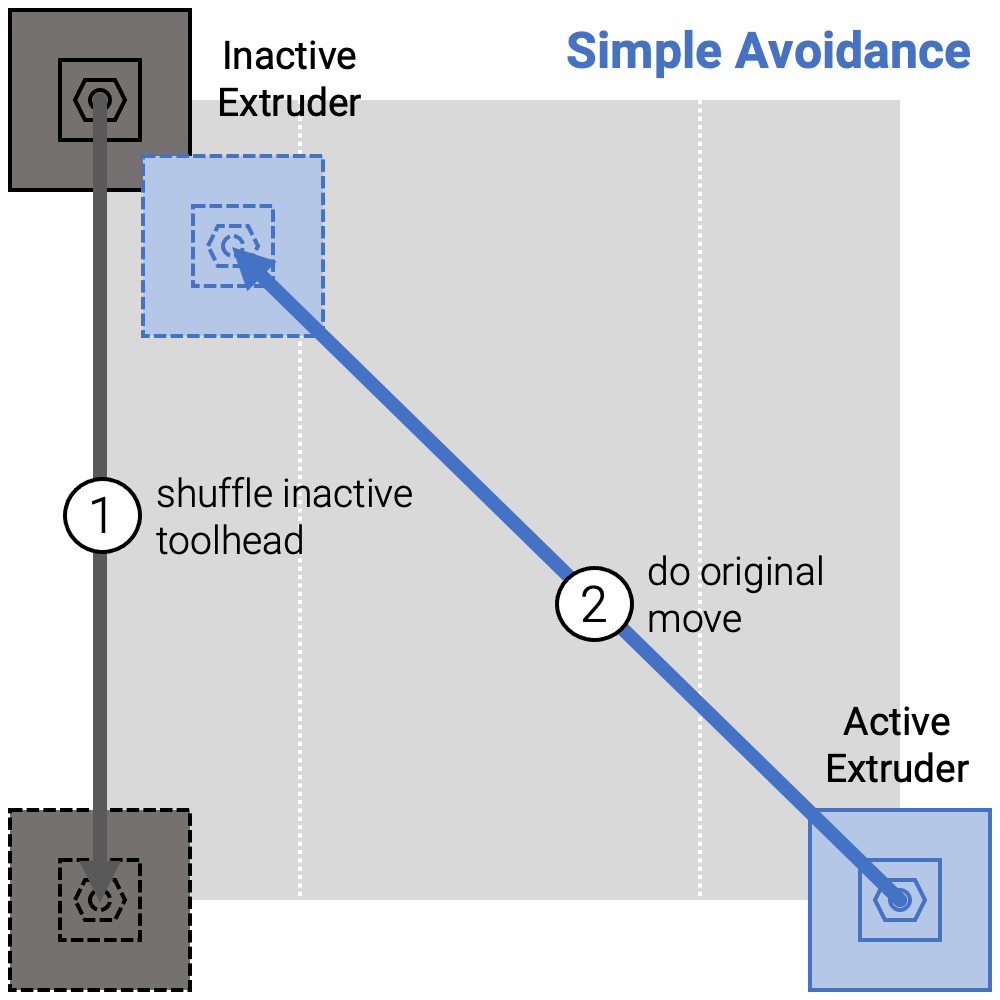

## Software

This early video shows the motion and introduces the core challenge: two toolheads moving in a shared space.  I didn't know if it work would at all when this was made!

[Early video showing motion in a shared space](https://www.youtube.com/watch?v=kvWQ7X1aL_c)

There are a few ways to handle the "two toolheads, one workspace" challenge, for a single print.

Here are the different cases, visualized, with more details explanations below.

| Option | Visualization | Notes |
| - | - | - |
|  |  | - |
| **Single Toolhead**: <p><p>Full Workspace <p><p> 100% travel |  | Ditch one of the toolheads, and Dual Gantry reduces to a single CoreXY. You can leave the inactive toolhead on and lose a corner of printable space, or you can remove the second toolhead to get nearly the full printable space. <p><p> If you mostly print in one color/material, this full travel is ... well, useful! <p><p> In a way, your daily driver for single-extrusion prints can also be the project car for the weekend (multi-material and multi-color).  But that’s not why we’re here, is it?|
|  |  |  |
| **Dual Toolhead Modes** without collision detection and avoidance (below) | | These modes works similarly to an IDEX, where a toolchange macro (typically `T0` or `T1`) parks the now-inactive toolhead, and motion then continues with the newly-active toolhead.  These methods can be implemented with simple toolchange macros, but firmware simplicity comes at the cost of some printable space.|
| **Dual Toolhead**, Option 1: <p><p>Park in Opposite Corners <p><p> **49.7%** usable travel |  | Use the front left area, possibly with a regular V0 bed. You lose a toolhead's depth of X travel and a toolhead’s width of Y travel, yielding a nearly-square build area. |
| **Dual Toolhead**, Option 2: <p><p>Park in Back, <p>Print in Center <p>  **47.1%** usable travel |  | Use the center area.  It’s just like an IDEX here; you lose twice the depth of a toolhead in the X direction, but retain full Y.   |
| **Dual Toolhead**, Option 3:<p><p>Park in Back, <p>Print in Front <p><p> **67.6%** usable travel |  | Use the front area, and leverage a gantry design that can overlap in X, for more printable space.  Requires toolchange macros to move the active gantry back into the workspace first. |
| **Dual Toolhead**, Option 4: <p><p> Stay Within the Lines <p><p> **82.9%** usable travel |  | Use the front area in addition to the middle rear area, but assume each toolhead parks in a far corner.  <p><p> Requires a diligent slicer operator or the smart slicer itself to ensure that motion commands stay within the lines: cutting corners here could result in a collision.  Seems like a pretty-good option though. |
| | | |
| **Dual Toolhead Modes** *with* collision detection and avoidance (below) | | |
| **Dual Toolhead**, Option 5: <p><p>Interference Detection and Avoidance <p><p> **100%** usable travel |  | Ahhh yes.  Where it gets interesting! <p><p> For every travel move, some code must detect toolhead interference and proactively avoid it to use the full workspace. <p><p> **Read below for details.** |

It all makes me want to play some Tetris on a 1989 Game Boy, and play long enough to see a Buran take off again at the credits screen.

Anyway, for the calculations that drive the usable-travel numbers above, as well as V0 and V2 sizes, check [this spreadsheet](https://docs.google.com/spreadsheets/d/12tuhSCjSPbqNk4CZrzta5T9k3skF8ElGdcyRElUPhNI/edit?usp=sharing).

At smaller bed sizes, the simple options drastically reduce the usable bed size, motivating the use of interference detection and avoidance.  At larger sizes, there's less loss.  

Sure, you can always go "one size up" on the extrusions to get 100% usable bed fraction, by going with ~50mm wider X and Y extrusions and wider panels, and doing something simple, like *Park in Opposite Corners*.  But that means a larger, heavier printer, with more air to heat up, longer belt runs, and potentially more challenges with tuning.

If you can get 100% of the usable bed with software... why not use that?

### Interference Detection and Avoidance

**Ahhh yes.  Where it gets interesting!  Read on.**

For every travel move, some code:
* slicer
* G-code post-processor
* firmware

... must detect toolhead interferences and proactively avoid them in the full workspace.

Consider any G-code move command (`G0`, `G1`, `G28`, etc.), then ask this question:

> Would one toolhead (a ~40 mm x 53 mm rectangle in XY, plus some clearance) intersect with the other toolhead's rectangle, at any point in the motion for that move command?  

There are four distinct cases of motion here, at least when the toolheads are small relative to the travel.

An American football analogy will help us here.

| American Football Field | Dueling Zero Workspace |
| - | - |
|  |  |
|  |  |
| The **"endzones"** are in the far X positions, on each side.  | An endzone begins where one toolhead would potentially collide with the other far-X-position toolhead. |

We'll walk through the four distinct cases.

| Case | Explanation |
| - | - |
|  | **Case 1: No Avoidance Needed**<p><p>An interference can only occur if the move goes to a far X edge - to the endzone.  If the move doesn’t start or enter either endzone, and the inactive extruder is parked in the endzone, then nothing smart is needed. |
|  | **Case 2: Simple Avoidance**<p><p>If a move enters the endzone and there's a detected collision - more precisely: <p><p>“the bounds of the active toolhead’s travel intersect the inactive toolhead's bounds" <p><p> …then an active intervention, in the form of an **"endzone shuffle"**, is needed.  This will be our term for an inactive toolhead moving from the front to the back, or the back to the front, to get out of the way of the active toolhead.  <p><p>Say the inactive extruder is in the way - in a corner - and is approached via an X move.  The inactive extruder must get out of the way, by doing an endzone shuffle.  To minimize print artifacts, a filament retract is needed here, followed by the original move.  This is the simple avoidance case:<p><p>(1) shuffle inactive toolhead<p><p>(2) do original move.<p><p>Full-length endzone shuffles (corner-to-corner moves) are not required, or optimal, but are simpler to implement and explain.  Assume for the rest of the discussion here that all toolhead parking is in a corner.
|  | **Case 3: Backup-X Avoidance**<p><p>Now, imagine that the active extruder is in the endzone, in a location where the inactive toolhead would smack into the active extruder during the shuffle, but the active toolhead is not overlapping the final location of the inactive one.<p><p>Here, the answer is to back the active toolhead out of the way first.  The sequence looks like this:<p><p>(1) back up the active toolhead: move it out of the “endzone”<p><p>(2) shuffle inactive toolhead<p><p>(3) restore X position of active toolhead<p><p>(4) do original move<p><p>The picture shows a bit more backup than absolutely needed, but you get the idea. |
|  | **Case 4: Segmented Avoidance**<p><p>If the inactive toolhead’s shuffle would cause it to overlap with the current active extruder’s position - when it’s in the corner of an endzone - we need to do something a little smarter.<p><p>Say the left toolhead is inactive in the rear left corner, and then the right toolhead continues on a counter-clockwise circle along the edge of the print area, getting to the front left.  The toolheads are now in opposite corners of the same endzone.<p><p>*There is no single move that works.  The two toolheads must switch positions, and the move must be split.*<p><p>Time to do an "**endzone dance**"! <p><p>The move command is split into two parts.  The first part moves the active toolhead into a position where it will no longer interfere with the inactive extruder, post-shuffle. The second part completes the original move from the partway point.  <p><p>The sequence looks like this:<p><p>(1) do first part of the original move<p><p>(2) back up the active toolhead: move it out of the “endzone”<p><p>(3) flip inactive toolhead<p><p>(4) restore X position of active toolhead<p><p>(5) do second part of the original move<p><p>The first part of the move is necessary to ensure that the Y position of the active toolhead “just clears” the future position of the post-shuffle inactive toolhead.

Endzone dancing adds print time and the potential for print artifacts (from retractions), but it’s necessary to use the full travel.  When does it happen?

##### Worst-case for Segmented Avoidance

The worst case for motion is when **every** travel move triggers an endzone dance; for example, this condition occurs when printing an end of a square and when using a square-aligned infill direction (0 degrees or 90 degrees).

TBD: pics of motions matching this description

More generally, endzone dancing is needed for each outer perimeter of a full-size square.

> This is the downside of the Dual Gantry approach. It is what it is.

However, some straightforward techiques can help us avoid it.

###### Rotate Long Parts

Don’t hang out in the endzone if it’s not necessary! Long, skinny parts can be reoriented to use the full Y height with park-in-the-back mode, or on a diagonal with the park-in-opposite-corners mode.

###### Rotate Infill

Rotate the infill direction to 45 degrees, so that the inactive extruder is only in the way twice for each square.

###### Use Fewer Perimeters

Avoid outer perimeters on large parts to avoid endzone dancing.  For example, go from 4 to 3 outer perimeters and increase the outer perimeter width to compensate.

###### Minimal Shuffles

Instead of doing a full-Y-travel move for each flip, what about minimizing the shuffle distance to only what’s necessary?

###### Simultaneous Motion

The inactive extruder could get out of the way, while the extruder is on the other side, to hide some of the time cost of the dancing.  

Simultaneous motion can be triggered with the two-Klipper control option, where each gantry is independently controlled.  Doing this with RepRapFirmware would require at least minor changes to the generated G-code to drive XY and UV (second-gantry) axes simultaneously.  Any implementation that assumes the use of `T0` and `T1` commands to share XY move commands between gantries cannot enable this.

###### Preemptive Positioning

The G-code processor could be smarter with positioning to avoid the need for retractions for interesting shapes, like a C-shaped part where one toolhead preemptively darts to the correct spot to get out of the way, or even just parks in the crook of the C shape and never moves.

### Duplication and Mirroring

A side benefit of Dual Gantry - like IDEX - is the option of simultaneous multi-part modes that split up the workspace.  Here, we assume that collision detection and avoidance enables full workspace access.

* Duplication Mode: like an IDEX, split the workspace in two:
  * Usable bed space: divide the bed in two.
    * 2x 85 x 170.

* Mirror mode: similar, but you leave space for the toolheads to never touch, so less space is usable.
  * Usable bed space: divide the bed in two and leave an interior gutter.
    * 2x 60 x 170.

However, you could get more flexibility to use the space with a slight bit of slicer awareness.  Imagine offsetting the start Y positions for two mirrored parts so that you get effectively higher overlap than a simple static partitioning (two circles, each larger than half the bed width or height).  You could print two half-bed-size triangles at the same time, for example.

Or, imagine having two streams of independent G-code, where the streams are sync’ed at Z moves.  

[Apparently this will be a thing for RRF for version 3.5](https://forum.duet3d.com/topic/29023/independent-dual-gantry-any-examples-out-there/3?_=1656291960523)!

You can then print completely different parts at the same time.  How cool is that?  IDEX can never do that.

### Current Software Implementations

The software and firmware side for Dual Gantry printers will be an evolving space - to implement the optimizations described above, but also to reduce the complexity of configuration and tuning for new builds.

**Watch out for new stuff here.  Join in!**

At minimum, any Dual Gantry-capable firmware needs to control both gantries.  If you want full travel, you also need *something* to ensure safety and insert moves with added G-codes.  

You’ll need to align the toolheads in XYZ too.  Z alignment can be easily automated with a shared Tri-Zero nozzle endstop. XY alignment is the same process as with an IDEX, of either:
* measuring with Vernier-style or other test prints or macros
* jogging printer motion with an upward-facing nozzle camera to measure the temp offset
* connecting up to a camera and using machine vision a la [TAMV](https://jubilee3d.com/index.php?title=TAMV)

Below are your software options.. at least, the ones that come from Zruncho with :heart:.

#### RepRapFirmware (RRF)

RRF has built-in support for CoreXYUV built-in, which makes it stupid simple here to at least get the axes in motion.  You select this printer type with a single G-code command, where you map the X, Y, U, and V axes to your printer control board’s stepper outputs.  Then you configure a homing macro to home all axes, and then you add macros to execute on each toolchange, specifically, to park the toolheads in opposing corners.

As long as the slicer spits out `T0` and `T1` commands, like for an IDEX, everything should then “just work”, for the `Dual Toolhead, No Avoidance Needed` case.

This was a big surprise!  

In fact, the main Duet/RRF developer, David Crocker, made it easy and general for all kinds of “linear axis combination” machines to flexibly use the same firmware.   See [this forum post](https://forum.duet3d.com/topic/22850/stacked-dual-markforged-kinematics-possible?_=1655971338993):

> "...after I implemented CoreXY, CoreXZ, Core XYU and CoreXYUV kinematics, I got fed up with having to add a new kinematics class every time someone wanted another variant of CoreXY. That is why RRF now has a universal linear kinematics class, which supports any kinematics for which the motion of every axis is a linear combination of the motion of each axis motor, up to the maximum number of axes supported."

That’s what we have here - a 2 simple linear combinations for motion.

Nice going, David!  Impressive foresight.

RRF “just works” here.  There is a known-good configuration for a Duet 2 Wifi board in the `Configs/Duet2RRF` folder.   

NOTE: This config is gantry-only. You’ll need to add your Z and E config.

For the curious, here are the most relevant RepRapFirmware documentation pages:

* [Configuring RepRapFirmware for CoreXY Printer](https://docs.duet3d.com/en/User_manual/Machine_configuration/Configuration_coreXY)
* [M669]((https://docs.duet3d.com/User_manual/Reference/Gcodes#m669-set-kinematics-type-and-kinematics-parameters)): Set type to K8 (CoreXYUV)
* [M584](https://docs.duet3d.com/User_manual/Reference/Gcodes#m584-set-drive-mapping): Set drive mapping (add U & V axes)
* [M563](https://docs.duet3d.com/User_manual/Reference/Gcodes#m563-define-or-remove-a-tool): Define tools

**To be clear, this config does not handle the `Dual Toolhead, With Avoidance Needed` case.**

To support that case, you would need to make at least these changes:

* Change printer config type to not map XY and UV axes to XY motion commands: in the M669 command, change away from type K8, probably to K1 and with a custom movement matrix
* Generate separate XY and UV commands in the G-code post-processor
* Replace `T0` and `T1` macros with G-code equivalents

#### Klipper

Klipper supports a massive ecosystem of control boards, sees new features added frequently (especially Input Shaper), and supports many toolhead boards that work well in a printer with tiny toolheads like Dueling Zero.

##### Klipper Patch for Dual Gantry CoreXY

As of 2022-08-18, however, Klipper mainline does not *directly* support a Dual Gantry printer.

No problem.  Thanks to a collaboration between Zruncho and Tircown (a developer of the highly-related Klipper IDEX code), there is a single patch for this.

GO HERE.

**Configuration:**

To use Dual Gantry support, the minimal Klipper configuration must:
* Add [stepper_u] and [stepper_v] sections for the second gantry, along with corresponding stepper-driver sections
* Specify `kinematics: dualgantry_corexy` in the printer section
* Define T0 and T1 macros with SET_DUAL_CARRIAGE inside

A sample file to configure a full printer with 2x SKR Pico boards and 2x CAN toolhead boards is avaliable in [link TBD]().

However, all kinds of other stuff must evolve when going from one to two extruders.  `PRINT_START`, `CANCEL`, even `HOME`, are all are macros that really need dual-extruder awareness to prevent collisions in all cases.  Take a look at these.

#### Software Smart Avoidance

This repo includes a G-code postprocessor called duel.py that modifies a G-Code file to safely handle all movement cases.  It has to assume a starting position and needs the specific toolhead-size and XY motion bounds.  

TODO: instructions on how to add to a slicer.

`duel.py` uses a few Python modules to simplify the implementation:
* [gcodeparser](https://pypi.org/project/gcodeparser/): a simple parser to turn ASCII lines into modifiable python objects
* [requests](https://pypi.org/project/requests/): the usual Pythonic way to do clean REST interactions
* [cmd](https://docs.python.org/3/library/cmd.html): a simple way in Python to do interactive programs.  “Battle mode” is a little easter egg.
* [shapely](https://pypi.org/project/Shapely/): a geometry library
* [nose](https://pypi.org/project/nose/): test-running library

The polygon intersect from Shapely enables interference detection.

That code looks like this, with a function `get_toolhead_bounds()` to get toolhead bounds as a shapely.geometry.Polygon instance:

```
    poly1 = get_toolhead_bounds(p1)
    poly2 = get_toolhead_bounds(p2)
    overlap = poly1.intersects(poly2)
```

One mildly interesting bit is the move split needed for the Segmented Avoidance case, which can be handled with basic y = mx + b math.  

Aside from these bits, the code is pretty straightforward... surprisingly so.

`duel.py` is also capable of driving two independent Klipper instances in a "Ships in the Night"-style setup.  This code enabled me to validate the avoidance algorithms on a real printer, before modifying Klipper, but for all kinds of reasons, the integrated Klipper version is better: no static port partitioning, no easy ability to use a shared nozzle endstop, and no ability to use a single web interface for the whole printer, amongst other issues.
